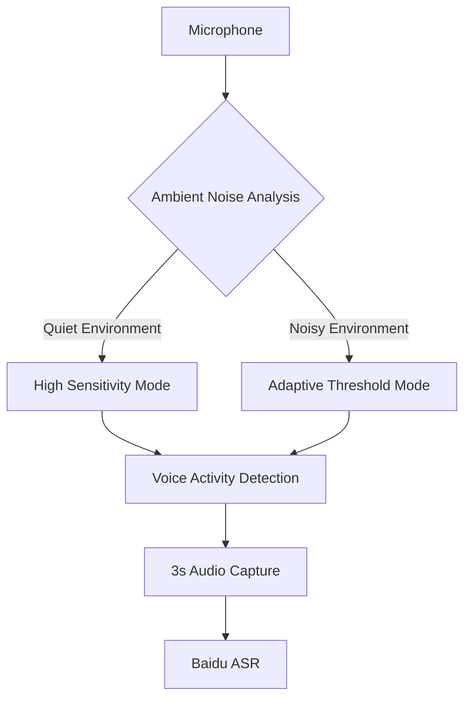
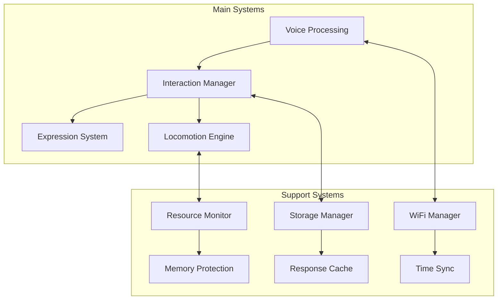

# ESP32-S3 Interactive Quadruped Robot

 *Replace with actual robot video/gif*

Meet "Iron Claw (Tie Zhua)" - an expressive quadruped robot that understands your voice, responds with personality, and moves with lifelike grace. Built on ESP32-S3, this open-source companion features:

- 🎙️ Natural voice interaction in Chinese
- 👀 Emotive OLED eyes showing 6 emotional states
- 🦵 Biomimetic quadruped locomotion
- 🤖 Playful personality with contextual responses
- 🧠 Hybrid AI (local + cloud processing)

## 🌟 Character Personality & Behaviors

"Iron Claw" is designed with a distinct personality that makes interactions feel natural and engaging:

### 🗣️ Speech Characteristics
- Uses informal, friendly language ("Hey! What's up today?")
- Adds playful suffixes to sound natural
- Short responses (under 25 characters) for immediacy
- Self-deprecating humor ("My camera resolution is too low to see")
- Onomatopoeia for expressions ("Zzz" when sleeping)

### 👁️ Eye Expressions
| State | Behavior | Trigger |
|-------|----------|---------|
| **Idle** | Slow blinks, random eye movements | Default state |
| **Listening** | Wide open eyes, quick micro-blinks | Voice detected |
| **Thinking** | Rapid side-to-side eye movements | Processing query |
| **Moving** | Focused "squint", follows direction | During locomotion |
| **Happy** | Upward-curved "smiling" eyes | After praise or dancing |
| **Sleeping** | Closed eyes with "Zzz" animation | 30s inactivity |

### 🐾 Movement Personality
- Adds small random variations to steps for naturalness
- Dances when praised ("Want to see another dance?")
- Tilts head slightly when confused
- Smooth transitions between positions
- "Stretches" after long idle periods

## 🧠 Intelligent Interaction Pipeline

The robot processes interactions through a sophisticated decision pipeline:

### 1. Voice Capture & Processing



**Key Innovations:**
- **Environmental Adaptation**: Automatically adjusts sensitivity based on ambient noise levels
- **Pre-buffering**: Captures 0.5s of audio before voice detection to catch quick commands
- **Intelligent Filtering**: Ignores invalid inputs like "I don't know" or background noise

### 2. Understanding & Response Generation

#### Decision Hierarchy:
1. **Immediate Actions** (time, date): 
   - "What time is it?" → Speaks current time immediately
   
2. **Predefined Interactions** (16 personality-driven Q&As):
   - "What's your name?" → "They call me Iron Claw! (*^∇^*)"
   - "Thank you" → "No problem! Want me to spin happily?"
   
3. **Movement Commands**: 
   - Understands variations: "Move forward", "Go left", "Turn right a little"
   
4. **Cloud AI** (DeepSeek API) for complex questions:
   - "Tell me a joke" → "Why don't robots go to the gym? They're afraid of software updates!"

**Context Preservation:**
- Maintains conversation context through interaction cycles
- Remembers recent topics for follow-up questions
- Learns frequent responses for faster replies

### 3. Physical Response Execution

#### Movement Intelligence:
- **Direction Handling**: Understands 4 directions with natural language variations
- **Distance Estimation**: Interprets relative distances:
  - "A little" = 2cm ± random variation
  - "Some" = 5cm ± variation
  - "A lot" = 15cm ± variation
  
- **Gait Control**:
  - Diagonal gait pattern for stability
  - Swing phase (foot lifting) vs support phase (pushing)
  - Automatic leg coordination

**Natural Motion Features:**
- Acceleration-limited movements
- Error recovery from stumbles
- Energy-saving posture when idle

## ⚙️ System Architecture

### Hardware Components
| Component | Function | Key Specs |
|----------|----------|-----------|
| **ESP32-S3** | Main processor | Dual-core 240MHz, 512KB SRAM |
| **INMP441** | Voice input | Omnidirectional MEMS mic |
| **MAX98357** | Audio output | 3.2W Class D amplifier |
| **OLED Display** | Expressive eyes | 128x64 resolution |
| **PCA9685** | Servo control | 16-channel PWM controller |
| **MG90S Servos** (x8) | Leg movement | 180° rotation, 2.2kg/cm torque |

### Software Architecture

**Key Features:**
- **Hybrid Processing**: Balances local/cloud computation
- **Self-Preservation**: Auto-reboots on critical failures
- **Connection Resilience**: Automatic WiFi reconnection
- **Energy Awareness**: CPU frequency scaling during idle

## 🚀 Getting Started

### Hardware Setup
1. Connect servos using standard quadruped configuration
2. Wire I2S components for audio input/output
3. Connect OLED display via I2C interface

### Initial Configuration
```cpp

// Configurations (config.h)

const char* ssid = "YOUR_WIFI";

const char* password = "YOUR_PASSWORD";

const char* deepseekApiKey = "YOUR_DEEPSEEK_KEY";
```
### First Run
1. Upload firmware via PlatformIO
2. Robot will:
   - Initialize servos to neutral position
   - Connect to WiFi
   - Synchronize internet time
   - Play startup chime
3. Press wake button to start interaction

### Calibration Commands
```bash

Serial commands
eye.listening # Force listening expression

servo.test # Test servo range

gait.calibrate # Enter gait calibration
```
## 📜 License
MIT Licensed - See [LICENSE](LICENSE) for details.
